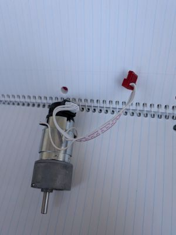
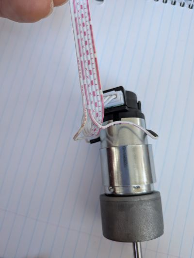
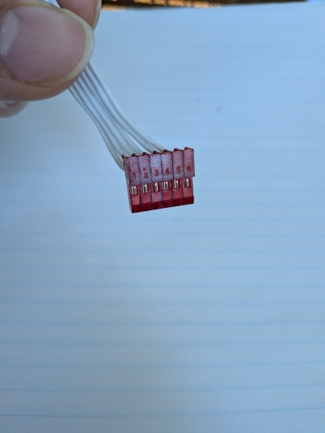
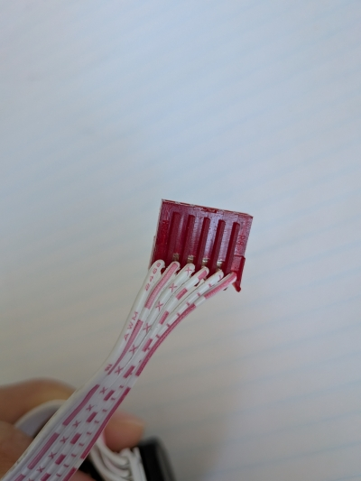
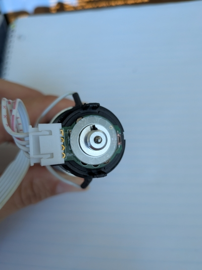

# Reverse Engineering the Celestron AVX Motors

## Visuals

Here is a perspective image of the full motor assembly removed from the telescope housing.

Here is a close up of the wiring markings.

Here is a Photo to help guide for the front and back of the main red connector used on the main controller board.

## Pinouts

The following pinouts are observed:

| Pins  | Markings  | Functions     | Description |
|---    |---        |---            |---|
| Pin 1 | <blank>   | '+'ve lead    |---|
| Pin 2 | —— —— ——  | '-'ve lead    |---|
| Pin 3 | x x x x x | VCC           |---|
| Pin 4 | — — — — — | GND           |---|
| Pin 5 | ╷ ╷ ╷ ╷ ╷ | CA            |---|
| Pin 6 | ———— ———— | CB            |---|

## Hardware Breakdown

There are no visible markings to indicate what type of motor is being used, but upon opening the motor housing I learned that it is a simple brushed DC motor with PIN 1 and PIN 2 connected to the two brusged, which in turn are in contact with the commutator.

The shaft of the motor goes all the way up to the encoder in the top portion of the motor where it is connected to the code disk.

### Motor Control Board

- **Functional Requirement** | The communication for the DC motor shall be controlled using PWM control.
- **Functional Requirement** | The directionality for the DC motor shall be controlled using an H-bridge.
- **Functional Requirement** | An optical sensor shall be used to determine position response for motor control.